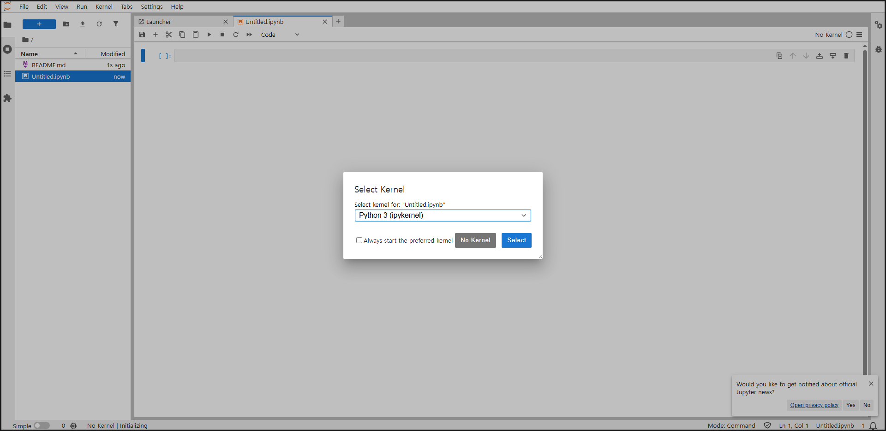

# Kernel이란 무엇인가?

- Jupyter Lab에서 코드를 실행하는 **엔진**
- 어떤 Python 환경에서 코드를 돌릴지 선택하는 것

# Jupyter Lab에서 의존성 설치하는 법
- 기존에 NoteBook을 만들고 콘솔에 입력하던 `pip` 이나 `conda` 명령어를 사용하면 된다.
- 단 실시간 설치 상황이나 진행률은 볼 수가 없기에 우측 상단의 Kernel 상태를 보거나 중간 중간 print 문을 넣어서 확인하는게 좋을것 같다.