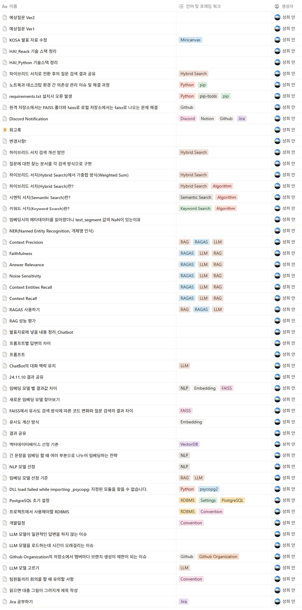

# JupyterLab_With_LangChain_UI

## 목적
- 면접과정에서 나온 기술 키워드인 쥬피터 랩과 랭체인 UI를 사용해보기 위해 기존에 개발했던 챗봇을 이식하기 위한 프로젝트

## 과정
- 기존에 작업했던 `HAI_Python`에서 챗봇 코어 이식(BM25+FAISS 하이브리드·RAG·API 유지)
- 신규 모델 적용 [gpt-oss-120b](https://huggingface.co/openai/gpt-oss-120b?inference_api=true&inference_provider=fireworks-ai&language=python&client=openai)
- 응답 중간 끊김 이슈 확인 → 250토큰 완결 지시 등 프롬프트 템플릿 수정

## 결과(실패로부터의 학습)
- `Jupyter Lab`은 제품화 이전 단계의 기능 구현·실험·검증에 더 적합하다는 점을 체감
    - 해당 사항을 미리 인지하지 못 하고 기능 이식을 우선하여 실험 과정을 못 보여드림
- `LangChain UI`는 초기 빌드 성능과 환경 의존(.env) 이슈로, 이번 타임박스에서는 노트북 데모에 부적합
- `Jupyter Lab`을 사용해서 실험과 검증 능력을 보여드리기에는 시간이 부족한 상황

### 기존에 실험한 것들
- [임베딩 방식 변경](https://github.com/HAI-Heritage-AI/HAI_Python/tree/main/app/faiss)
- [RAG 성능 평가](https://github.com/HAI-Heritage-AI/HAI_Python/tree/main/app/ragas)
### 해커톤을 진행하며 두달간의 문서화 기록

[이미지 링크](https://sixth-camera-cfe.notion.site/1155ad4f812a8021834bd69465866b81?v=6c2681acda7e44659f1af2e4a615368d)